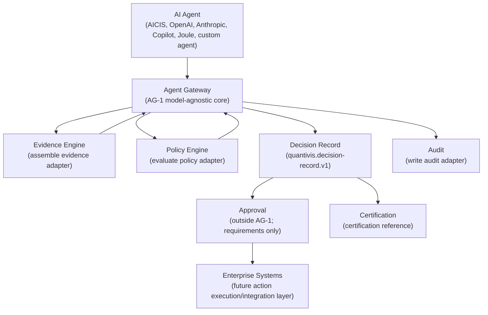
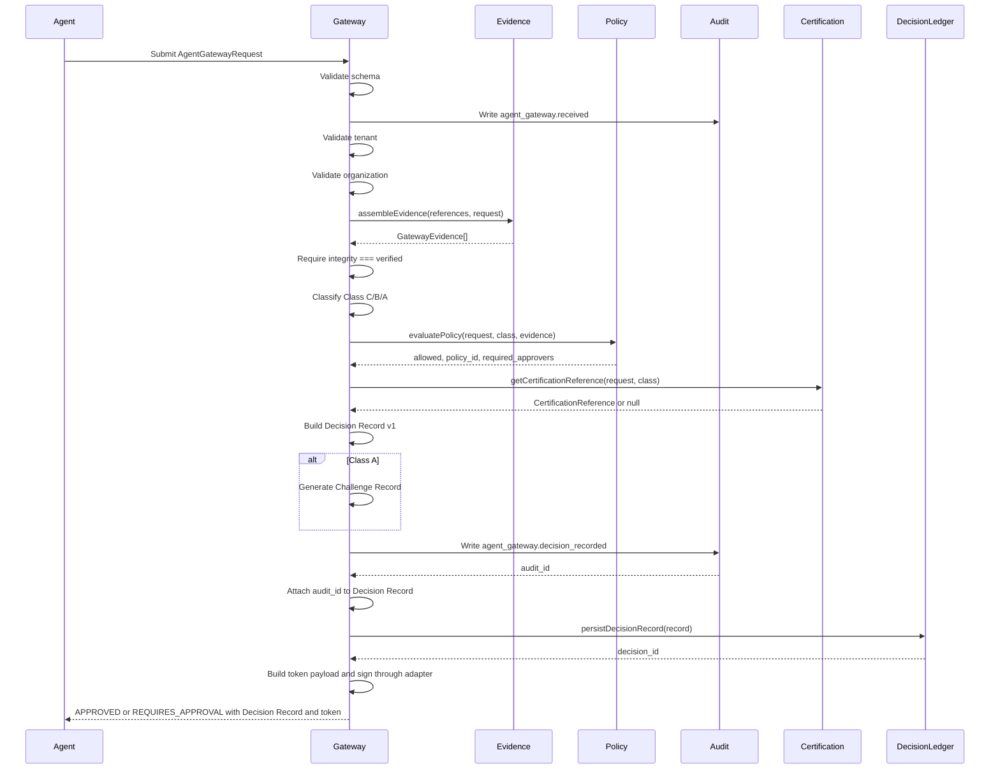
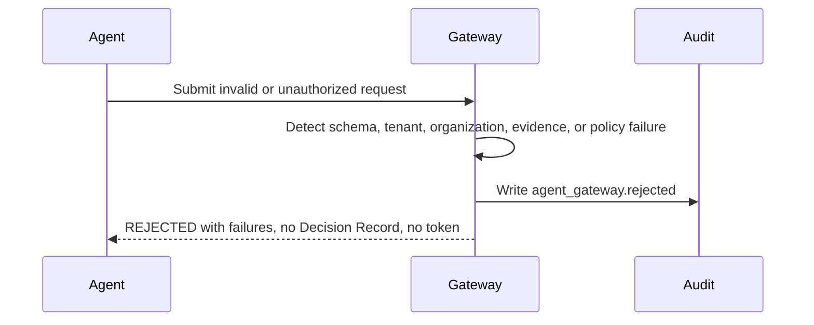

# AG-1 Agent Gateway Architecture Specification

## 1. Purpose

The Agent Gateway exists to provide a vendor-neutral governance boundary for AI-influenced enterprise decisions. It is the API-layer contract that an AI agent must pass through before a consequential enterprise action can be approved, routed for approval, or rejected.

In the current AG-1 implementation, the gateway is implemented as a pure TypeScript core module, not as a deployed HTTP endpoint. It accepts a model-agnostic request object and injected adapters for tenant validation, organization validation, evidence assembly, policy evaluation, audit creation, Decision Record persistence, token signing, time, ID generation, and certification reference resolution.

The gateway fits into the Quantivis architecture as follows:

- **AICIS**: AICIS can act as one possible upstream intelligence engine or agent. AG-1 does not assume AICIS-specific behavior. AICIS submits the same gateway request shape as any other agent.
- **Quantivis**: Quantivis remains the governance, approval, evidence, audit, and certification system. The gateway creates a Decision Record that Quantivis can persist, review, certify, and later connect to approval workflows.
- **Enterprise Decision Governance**: The gateway separates agent recommendation from enterprise authorization. It validates context, checks evidence, classifies decision criticality, evaluates policy, and determines whether approval is required.
- **Evidence Engine**: The gateway delegates evidence assembly to an injected `assembleEvidence` adapter and rejects requests unless every assembled evidence item has `integrity: "verified"`.
- **Certification Engine**: The gateway links each successful Decision Record to a certification reference. By default AG-1 links to the Quantivis enterprise certification framework, the Decision Pipeline gate, the `decision-lifecycle` pipeline, and deployment verification.

AG-1 is explicitly vendor-neutral and model-agnostic. It has no OpenAI, Anthropic, Microsoft, SAP, ServiceNow, or AICIS dependency in its gateway logic. Model metadata is accepted as optional request metadata and copied into the Decision Record when present.

## 2. Responsibilities

The AG-1 gateway is responsible for:

- **Schema validation**: Validates the incoming agent request with a Zod schema.
- **Tenant validation**: Calls an injected `validateTenant` adapter using `tenant_id`.
- **Organization validation**: Calls an injected `validateOrganization` adapter using `tenant_id` and `organization_id`.
- **Evidence assembly**: Calls an injected `assembleEvidence` adapter with request evidence references.
- **Evidence integrity verification**: Requires all assembled evidence items to have `integrity: "verified"`.
- **Decision classification**: Classifies the request as Class C, Class B, or Class A using risk level and business impact amount.
- **Policy evaluation**: Calls an injected `evaluatePolicy` adapter with the request, decision class, and assembled evidence.
- **Approval routing**: Determines whether the request can be approved immediately or requires approval based on class and policy-required approvers.
- **Challenge generation**: Creates a Challenge Record for Class A decisions.
- **Decision Record creation**: Builds a versioned `quantivis.decision-record.v1` Decision Record.
- **Audit creation**: Writes an audit event when a request is received, when a request is rejected, and when a Decision Record is created.
- **Certification linkage**: Attaches an injected or default certification reference to successful Decision Records.
- **Signed decision token generation**: Builds a token payload and delegates signing to an injected `signDecisionToken` adapter.

The gateway deliberately does **not**:

- Execute the requested enterprise action.
- Perform final human approval.
- Replace the Decision Ledger.
- Replace the Evidence Engine.
- Replace the Certification Engine.
- Replace the audit framework.
- Call live AI providers.
- Assume any specific model vendor.
- Call Supabase directly.
- Implement RLS policies.
- Implement product UI.
- Deploy a public HTTP endpoint in AG-1.
- Perform cryptographic signing internally. Signing is adapter-provided.
- Provide replay protection or idempotency guarantees in AG-1.
- Mint decision tokens for rejected requests in AG-1.

## 3. Architecture Diagram

## 4. Request Contract

AG-1 accepts an `AgentGatewayRequest`.

| Field | Purpose | Validation | Required | Example |
| --- | --- | --- | --- | --- |
| `agent_id` | Identifies the submitting agent. Used as the audit actor when available. | Non-empty string. | Required | `"agent-aicis-prod"` |
| `tenant_id` | Identifies the tenant boundary. Used for tenant validation and cross-tenant rejection. | Non-empty string. | Required | `"tenant-acme"` |
| `organization_id` | Identifies the organization under the tenant. Used for organization validation and audit context. | Non-empty string. | Required | `"org-acme"` |
| `decision_type` | Categorizes the decision being requested. | Non-empty string. | Required | `"pricing_action"` |
| `requested_action` | The action the agent wants to take or recommend. | Non-empty string. | Required | `"Reduce discount leakage on strategic accounts"` |
| `evidence_references` | References to evidence the gateway adapter should assemble. | Array of non-empty strings. Defaults to empty array when omitted. | Optional | `["ev-price-001", "ev-policy-001"]` |
| `confidence` | Agent-submitted confidence score. Stored in the Decision Record as `agent_submitted`. | Number from 0 to 100 inclusive. | Required | `82` |
| `business_impact.amount` | Numeric business impact used for classification thresholds. | Optional finite number. | Optional | `250000` |
| `business_impact.currency` | Currency associated with the impact amount. | Optional string with length 3 to 8. | Optional | `"EUR"` |
| `business_impact.description` | Plain-English business impact description. | Non-empty string. | Required | `"Estimated annual margin recovery"` |
| `risk_level` | Risk level used for decision classification. | Enum: `"low"`, `"medium"`, `"high"`, `"critical"`. | Required | `"medium"` |
| `justification` | Agent justification for the requested action. | Non-empty string. | Required | `"Pricing variance crossed policy threshold with verified evidence."` |
| `metadata` | Vendor-neutral extension field. AG-1 reads optional `metadata.model` for Decision Record model metadata. | Object record. Defaults to `{}` when omitted. | Optional | `{ "model": { "provider": "model-agnostic", "name": "external-agent", "version": "2026-07" } }` |

Validation behavior:

- Invalid schema returns `REJECTED`.
- Invalid schema creates an `agent_gateway.rejected` audit event when the provided audit adapter succeeds.
- Invalid schema does not create a Decision Record.
- Invalid schema does not generate a decision token.

## 5. Decision Classification

AG-1 classifies decisions with `classifyAgentDecision({ risk_level, amount })`.

### Class C

Class C is the lowest risk class in AG-1.

Current rule:

- `risk_level` is `"low"`, and
- `business_impact.amount` is absent or below `50,000`.

Approval effect:

- If policy allows the request and returns no required approvers, AG-1 returns `APPROVED`.

### Class B

Class B is the intermediate class.

Current rule:

- `risk_level` is `"medium"`, or
- `business_impact.amount` is at least `50,000` and below `500,000`.

Approval effect:

- AG-1 returns `REQUIRES_APPROVAL` when the policy adapter requires approvers.
- In tests, Class B maps to `["business_owner"]` through the mocked policy adapter.

### Class A

Class A is the highest class in AG-1.

Current rule:

- `risk_level` is `"high"`, or
- `risk_level` is `"critical"`, or
- `business_impact.amount` is at least `500,000`.

Approval effect:

- AG-1 returns `REQUIRES_APPROVAL`.
- AG-1 generates a Challenge Record.
- In tests, Class A maps to `["executive_sponsor", "risk_owner", "compliance_owner"]` through the mocked policy adapter.

The classification thresholds are implemented in code, not yet in an external policy-as-code registry.

## 6. Evidence Flow

Evidence assembly occurs inside the injected `assembleEvidence(references, request)` adapter.

AG-1 passes:

- the request's `evidence_references`, and
- the parsed `AgentGatewayRequest`.

The adapter returns an array of `GatewayEvidence` objects:

- `id`
- `uri`
- `hash`
- `integrity`
- optional `summary`
- optional `source`
- optional `metadata`

AG-1 integrity behavior:

- Every evidence item must have `integrity: "verified"`.
- If any evidence item has `integrity: "unverified"` or `integrity: "failed"`, AG-1 returns `REJECTED`.
- Evidence-integrity rejection writes an `agent_gateway.rejected` audit event with failure code `evidence_integrity_failed`.
- Evidence-integrity rejection does not persist a Decision Record.
- Evidence-integrity rejection does not generate a decision token.

Evidence references are stored in two places after successful processing:

- the full assembled evidence array is stored in `DecisionRecord.evidence`;
- evidence hashes are included in audit event payloads and in the request hash basis.

AG-1 does not itself fetch files, inspect documents, validate cryptographic evidence hashes, or query the Decision Ledger. Those behaviors belong to the Evidence Engine adapter.

## 7. Challenge Generation

AG-1 creates a Challenge Record only for Class A decisions because Class A represents high or critical risk, or high business impact. These decisions require explicit counterargument and governance visibility before downstream approval or execution.

The Challenge Record contains:

- `strongest_argument_against`
- `missing_evidence`
- `contradictory_evidence`
- `regulatory_concerns`

Current AG-1 behavior:

- `strongest_argument_against` is generated as a plain-English warning not to execute the requested action until business impact, risk owner, and evidence chain are independently reviewed.
- `missing_evidence` contains `"No evidence references submitted."` only when the request has zero evidence references.
- `contradictory_evidence` is populated by scanning evidence summaries and metadata for the words `contradict` or `conflict`, case-insensitive, and returning matching evidence IDs.
- `regulatory_concerns` contains `"Critical-risk action requires human governance review before execution."` only when `risk_level` is `"critical"`.

AG-1 does not yet perform semantic contradiction analysis, legal/regulatory mapping, or LLM-generated challenge synthesis. Those are AG-2+ extension points.

## 8. Decision Record v1

AG-1 creates a versioned Decision Record with `decision_version: "quantivis.decision-record.v1"`.

Fields:

| Field | Purpose |
| --- | --- |
| `decision_id` | Stable identifier for the generated decision record. Provided by injected `generateId("decision")` or fallback timestamp ID. |
| `decision_version` | Schema version. Current value is `quantivis.decision-record.v1`. |
| `tenant.tenant_id` | Tenant boundary for the record. |
| `organization.organization_id` | Organization boundary for the record. |
| `agent.agent_id` | Submitting agent identity. |
| `model` | Optional model metadata extracted from `metadata.model`; otherwise `null`. |
| `decision_class` | `Class C`, `Class B`, or `Class A`. |
| `recommendation.decision_type` | Request decision category. |
| `recommendation.requested_action` | Action requested by the agent. |
| `recommendation.justification` | Agent justification. |
| `recommendation.business_impact` | Business impact object from the request. |
| `evidence` | Assembled verified evidence objects. |
| `confidence.score` | Agent-submitted confidence score. |
| `confidence.source` | Current value is `agent_submitted`. |
| `risk.level` | Request risk level. |
| `approvals.required_approvers` | Required approver roles returned by policy evaluation. |
| `approvals.policy_id` | Policy identifier returned by policy evaluation. |
| `approvals.approval_state` | `APPROVED` or `REQUIRES_APPROVAL` for persisted records. |
| `challenge` | Challenge Record for Class A; otherwise `null`. |
| `audit.audit_event_id` | Audit event ID returned by `writeAuditEvent` for `agent_gateway.decision_recorded`. |
| `audit.request_hash` | Stable request hash over agent, tenant, organization, requested action, and evidence hashes. |
| `timestamps.requested_at` | Current gateway time from injected `now()` or system clock. |
| `timestamps.decided_at` | Same as `requested_at` in AG-1 because gateway routing is synchronous. |
| `timestamps.expires_at` | `requested_at` plus 24 hours. |
| `status` | `APPROVED` or `REQUIRES_APPROVAL` for successful records. |
| `outcome_reference` | Currently `null`; reserved for later outcome tracking. |
| `certification_reference` | Injected or default certification linkage. |
| `metadata` | Original request metadata. |

Versioning strategy:

- v1 is intentionally explicit and stable.
- Future incompatible fields should create `quantivis.decision-record.v2`.
- Optional additive fields may be added to v1 only if older readers can safely ignore them.
- The long-term roadmap is an open Decision Record Format, but AG-1 does not claim that standard exists yet.

## 9. Signed Decision Token

AG-1 returns a `SignedDecisionToken` only for successful gateway outcomes:

- `APPROVED`
- `REQUIRES_APPROVAL`

Token payload fields:

| Field | Purpose |
| --- | --- |
| `decision_id` | Links the token to the Decision Record. |
| `hash` | Stable hash of the Decision Record. |
| `approval_state` | `APPROVED` or `REQUIRES_APPROVAL`. |
| `expiry` | 24-hour expiry timestamp. |
| `required_approvers` | Required approvers from policy evaluation. |
| `token` | Signed token string returned by injected `signDecisionToken`. |

Security assumptions:

- AG-1 does not implement cryptographic signing internally.
- AG-1 delegates signing to an injected `signDecisionToken` adapter.
- The current stable hash uses deterministic in-process hashing for payload identity. It should not be treated as a cryptographic primitive.
- Production signing must use a real signing provider, key management, key rotation, and verification rules.

Rejected requests currently do not receive tokens because AG-1 avoids issuing an authorization-like artifact for invalid, unauthorized, policy-denied, or evidence-failed requests.

AG-2 options:

- Rejection tokens for traceability only, clearly marked as non-authorizing.
- Pluggable signing providers.
- JWT/JWS support.
- Key ID and algorithm metadata.
- Replay nonce and idempotency key binding.
- Token verification endpoint.

## 10. Multi-Tenant Model

AG-1 enforces tenant and organization boundaries through injected validators:

- `validateTenant({ tenant_id })`
- `validateOrganization({ tenant_id, organization_id })`

Current behavior:

- Tenant validation failure returns `REJECTED` with `tenant_validation_failed`.
- Organization validation failure returns `REJECTED` with `organization_validation_failed`.
- Cross-tenant or invalid organization requests are rejected before Decision Record persistence.
- Rejections are audited through `agent_gateway.rejected`.

Trust boundaries:

- The gateway core does not trust the submitted `tenant_id` and `organization_id` by itself.
- The gateway core relies on the injected validation adapters to confirm tenancy and organization membership.
- The gateway core does not query RLS policies directly.
- The gateway core does not replace runtime tenant isolation tests or database RLS.

## 11. Security Model

### Authentication assumptions

AG-1 does not authenticate the caller itself. It assumes authentication happens before or inside the adapter/API layer that invokes `processAgentGatewayRequest`.

Production deployment should authenticate:

- agent identity,
- tenant access,
- organization access,
- signing authority,
- API credentials or mTLS/OAuth token, depending on the integration pattern.

### Authorization

Authorization is split:

- tenant and organization validators reject invalid boundaries;
- policy evaluation determines whether the request is allowed and who must approve.

AG-1 does not execute final approvals.

### Audit guarantees

AG-1 writes audit events for:

- request received,
- rejected request,
- decision recorded.

For successful requests, AG-1 writes `agent_gateway.decision_recorded`, attaches the returned audit ID to the Decision Record, and then persists the Decision Record. This ensures the persisted record contains the immutable audit event reference.

If `writeAuditEvent` throws, AG-1 currently propagates the failure and does not return a successful gateway result. This is intentional fail-closed behavior for AG-1.

### Tamper resistance

AG-1 records:

- evidence hashes,
- a request hash,
- a Decision Record hash in the token payload,
- an audit event ID.

These are integrity anchors, not full tamper-proof storage guarantees. Tamper resistance depends on the injected audit store, Decision Ledger persistence layer, and signing adapter.

### Replay protection

AG-1 currently does not implement replay protection. It generates a 24-hour expiry timestamp but does not bind requests to nonces, idempotency keys, or replay stores.

Replay protection is deferred to AG-2.

### Idempotency

AG-1 currently does not implement idempotency. If the same valid request is submitted twice, the injected `generateId` behavior determines whether IDs collide or differ. Production adapters should add idempotency keys before exposing a public endpoint.

Idempotency is deferred to AG-2.

## 12. Failure Modes

| Failure mode | Current behavior |
| --- | --- |
| Invalid schema | Returns `REJECTED`, audits `agent_gateway.rejected` with `schema_validation_failed`, no Decision Record, no token. |
| Tenant mismatch or invalid tenant | Returns `REJECTED`, audits `agent_gateway.rejected` with `tenant_validation_failed`, no Decision Record, no token. |
| Invalid organization or cross-tenant organization | Returns `REJECTED`, audits `agent_gateway.rejected` with `organization_validation_failed`, no Decision Record, no token. |
| Policy denial | Returns `REJECTED`, audits `agent_gateway.rejected` with `policy_denied`, no Decision Record, no token. |
| Missing evidence references | Not rejected by itself in AG-1. If evidence assembly returns all verified evidence, processing can continue. For Class A, missing references are captured in the Challenge Record. If evidence assembly returns unverified/failed evidence, request is rejected. |
| Unverified or failed evidence | Returns `REJECTED`, audits `agent_gateway.rejected` with `evidence_integrity_failed`, no Decision Record, no token. |
| Low confidence | Not rejected directly in AG-1. Confidence must be between 0 and 100. Policy adapters may use confidence to deny or require approval in future. |
| Failed audit write | Error propagates. AG-1 does not return a successful result if audit writing fails. |
| Failed certification reference resolution | If the optional `getCertificationReference` adapter throws, the error propagates. If the adapter is absent, AG-1 uses the default certification reference. |
| Failed Decision Record persistence | Error propagates after the `agent_gateway.decision_recorded` audit event has been written. |
| Failed token signing | Error propagates after Decision Record persistence. |

## 13. Sequence Diagram

Rejection sequence:

## 14. Scalability

AG-1 is designed as a stateless gateway core.

Scaling characteristics:

- No module-level mutable state.
- Tenant validation, organization validation, evidence assembly, policy evaluation, persistence, audit, signing, and certification are injected adapters.
- Horizontal scaling is possible when adapters are stateless or independently scalable.
- The gateway can run in an API server, Supabase Edge Function, worker, or other execution environment because it does not directly depend on browser APIs or vendor SDKs.

Expected future scaling approach:

- expose the gateway through a dedicated API endpoint;
- add idempotency keys for repeated agent submissions;
- move high-volume evidence assembly to asynchronous workers;
- write events to an event bus;
- use event sourcing for Decision Record lifecycle changes;
- separate synchronous validation from asynchronous certification and downstream enterprise integration.

## 15. Extension Points

AG-1 supports future providers by requiring all providers to submit the same model-agnostic request contract and by pushing vendor-specific behavior into adapters.

Provider integration examples:

- **OpenAI**: An OpenAI agent submits `AgentGatewayRequest`; model details go into `metadata.model`.
- **Anthropic**: An Anthropic agent submits the same request shape; no gateway logic changes.
- **AICIS**: AICIS submits as an upstream intelligence engine; no AICIS-specific gateway branch exists.
- **SAP Joule**: SAP-specific context can be carried in `metadata` and interpreted by adapters.
- **Microsoft Copilot**: Copilot action requests can use the same schema and provider metadata.
- **ServiceNow**: Workflow automation requests can be normalized into `requested_action`, `decision_type`, evidence references, and business impact.
- **Custom enterprise agents**: Custom systems only need to produce the contract and authenticate to the future API layer.

Adapter extension points:

- `validateTenant`
- `validateOrganization`
- `assembleEvidence`
- `evaluatePolicy`
- `persistDecisionRecord`
- `writeAuditEvent`
- `signDecisionToken`
- `getCertificationReference`
- `now`
- `generateId`

These extension points allow provider-specific authentication, policy, evidence lookup, signing, and persistence without modifying core gateway logic.

## 16. AG-2 Roadmap

Architectural improvements intentionally deferred from AG-1:

- Deployed HTTP/Supabase Edge Function endpoint.
- Real authentication and agent credential validation.
- Event sourcing.
- Policy-as-code registry.
- Configurable decision classification thresholds.
- Pluggable cryptographic signing providers.
- Key management and key rotation.
- Distributed immutable audit store integration.
- Replay protection with nonces or token binding.
- Idempotency keys and duplicate request detection.
- Rejection tokens for traceability, if required.
- Decision Record v2.
- Open Decision Record Format publication.
- Semantic contradiction detection.
- Regulatory mapping engine.
- Stronger Challenge Record generation.
- Async evidence assembly.
- Async certification pipeline linkage.
- Approval workflow execution.
- Enterprise action execution.

## 17. Verified Status

### Verified implementation

Files added:

- `src/lib/agent-gateway.ts`
- `src/test/agent-gateway.test.ts`

Implementation verified in code:

- request schema validation;
- classification helper;
- injected tenant validation;
- injected organization validation;
- injected evidence assembly;
- evidence integrity rejection;
- injected policy evaluation;
- approval-state routing;
- Class A Challenge Record generation;
- Decision Record v1 creation;
- audit event creation;
- audit event ID attached before Decision Record persistence;
- certification reference attachment;
- decision token payload generation;
- injected token signing;
- invalid/cross-tenant/policy/evidence rejection behavior.

Tests added:

- `src/test/agent-gateway.test.ts`

AG-1 focused test status:

- 10 tests passed.

Full repository verification performed after AG-1 implementation:

- `npm test`: 39 test files passed, 456 tests passed.
- `npm run build`: production build passed.
- `npm run evidence:test`: 181 tests passed.
- Scoped ESLint on `src/lib/agent-gateway.ts` and `src/test/agent-gateway.test.ts`: passed.

### Not implemented in AG-1

The following items are roadmap or adapter concerns and are not implemented in AG-1:

- deployed public API route;
- live staging or production execution;
- direct Supabase persistence;
- direct RLS changes;
- direct evidence document retrieval;
- direct cryptographic signing;
- replay protection;
- idempotency;
- policy-as-code;
- final human approval execution;
- enterprise system action execution.

