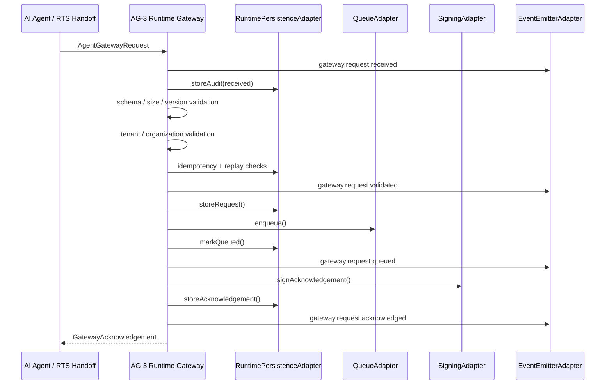
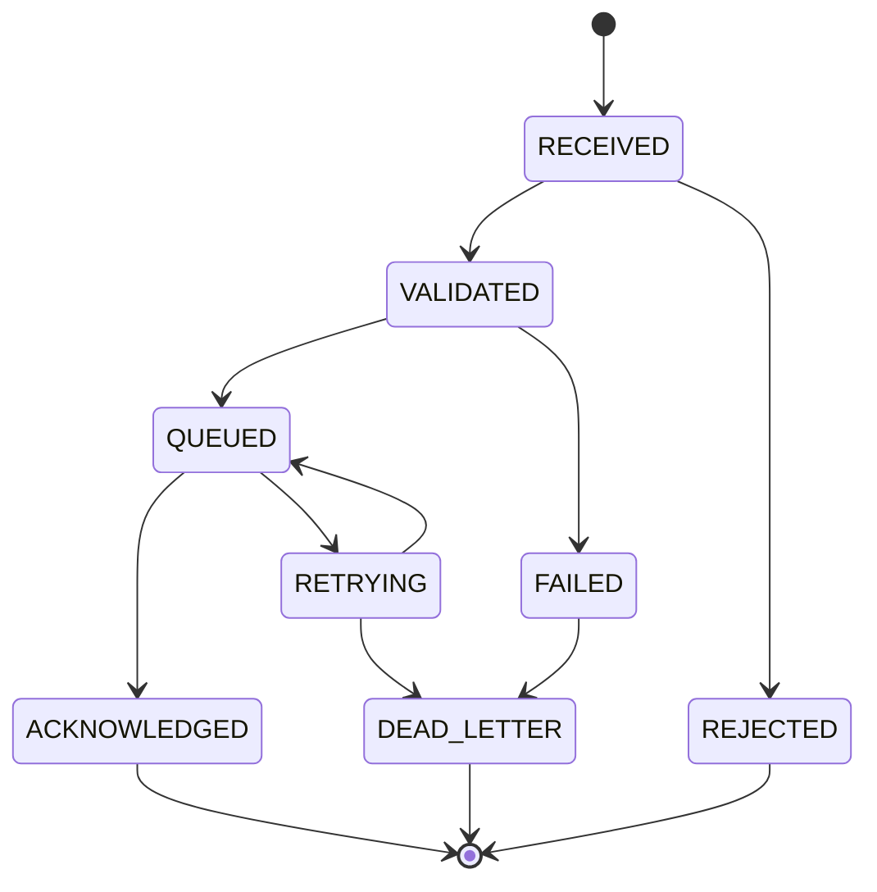

# AG-3 Runtime Gateway Architecture

## Purpose

AG-3A introduces the runtime foundation for exposing the existing AG-2 Agent Gateway contract as an operational service boundary.

AG-3A does not change AG-2 decision logic. It does not evaluate policies, create Decision Records, call AI models, perform approvals, execute business decisions, build connectors, or implement UI. Its responsibility is to receive an AG-2 `AgentGatewayRequest`, validate it as a runtime submission, persist runtime/audit evidence, enqueue it for downstream processing, and return a signed acknowledgement.

## Runtime Flow



## Adapter Architecture

AG-3A is adapter-based. The runtime core is deterministic and provider-neutral.

Implemented adapters:

- `QueueAdapter`
- `RuntimePersistenceAdapter`
- `SigningAdapter`
- `EventEmitterAdapter`

AG-3A includes deterministic in-memory/mock implementations for tests only:

- `InMemoryRuntimeQueueAdapter`
- `InMemoryRuntimePersistenceAdapter`
- `MockSigningAdapter`
- `MockRuntimeEventEmitterAdapter`

Real infrastructure adapters are intentionally deferred.

## Queue Abstraction

`QueueAdapter` defines:

- `enqueue()`
- `peek()`
- `ack()`
- `retry()`
- `deadLetter()`

AG-3A does not implement Kafka, RabbitMQ, Azure Service Bus, Supabase queues, or any external runtime queue.

## Persistence Abstraction

`RuntimePersistenceAdapter` defines:

- `storeRequest()`
- `storeAcknowledgement()`
- `storeAudit()`
- `markQueued()`
- `markDeadLetter()`
- `hasIdempotencyKey()`
- `hasRequestHash()`

AG-3A provides only an in-memory test implementation. Durable database persistence belongs to AG-3B/AG-3C.

## Acknowledgement Lifecycle

The runtime returns a signed acknowledgement only after:

1. request schema validation passes,
2. request size validation passes,
3. request version validation passes,
4. tenant validation passes,
5. organization validation passes,
6. idempotency and replay checks pass,
7. the request is stored,
8. the request is queued,
9. the acknowledgement is signed and stored.

`GatewayAcknowledgement` contains:

- `acknowledgement_id`
- `correlation_id`
- `request_hash`
- `gateway_version`
- `received_at`
- `status`
- `tenant_id`
- `organization_id`
- `schema_version`
- `runtime_version`
- `signature_key_id`
- `estimated_processing`
- `signature`

## Runtime State Diagram



Runtime states:

- `RECEIVED`
- `VALIDATED`
- `REJECTED`
- `QUEUED`
- `ACKNOWLEDGED`
- `FAILED`
- `RETRYING`
- `DEAD_LETTER`

## Correlation ID Lifecycle

Every request receives a deterministic `correlation_id`.

The correlation ID flows through:

```text
Gateway
↓
Queue
↓
Audit
↓
Decision Record (future)
↓
Outcome (future)
```

In AG-3A, the correlation ID is derived deterministically from tenant, organization, agent, and runtime request hash. Future runtime layers may add stronger globally unique generation while preserving correlation propagation.

## Idempotency and Replay Protection

AG-3A rejects:

- duplicate idempotency keys,
- replayed request hashes.

The runtime request hash intentionally excludes the idempotency key so a replay with a different idempotency key is still rejected when the material request content is identical.

Duplicate and replay rejections create runtime audit events and emit `gateway.request.rejected`.

## Retry Strategy

AG-3A defines `retry()` on the queue adapter and includes the `RETRYING` state, but does not implement a worker or retry scheduler.

Retry execution belongs to a later runtime worker phase.

## Dead-Letter Strategy

If queue enqueue fails, AG-3A:

1. records the adapter failure,
2. marks the request as dead-lettered in persistence,
3. emits `gateway.request.failed`,
4. emits `gateway.request.deadletter`,
5. returns a `DEAD_LETTER` runtime result.

Dead-letter replay, operator tooling, and durable retry queues are deferred.

## Health Check

`healthCheck()` returns:

- runtime version,
- gateway version,
- queue availability,
- queue depth,
- adapter availability,
- uptime,
- `ready`,
- `alive`.

The health check is in-process only. No HTTP endpoint is implemented in AG-3A.

## Operational Boundaries

AG-3A does not:

- implement an HTTP server,
- implement a Supabase Edge Function,
- implement real queue infrastructure,
- implement real persistence,
- implement real cryptographic signing,
- invoke AG-2 policy evaluation,
- create Decision Records,
- execute approvals,
- call AI providers,
- build connectors.

Those belong to later AG-3 phases.

## Verified Status

Implemented files:

- `src/lib/runtime-types.ts`
- `src/lib/runtime-gateway.ts`
- `src/test/runtime-gateway.test.ts`

Verified test coverage includes:

- valid runtime request,
- invalid schema,
- duplicate idempotency,
- replay detection,
- queue enqueue,
- acknowledgement creation,
- deterministic request hash,
- correlation ID generation,
- adapter failure,
- dead-letter transition,
- health endpoint,
- deterministic duplicate response.

AG-3A is a runtime foundation, not yet a deployed service.
