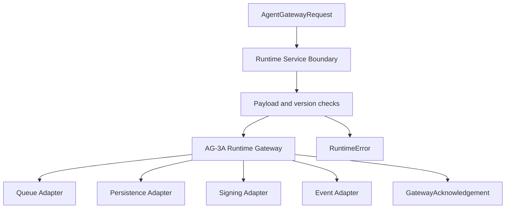

# AG-3B — Enterprise Runtime Service Contract

## 1. Purpose

AG-3B defines the framework-agnostic service boundary for the Quantivis Runtime Gateway.

AG-3A introduced the runtime foundation: validation, idempotency, replay protection, queue abstraction, audit events, and signed acknowledgements. AG-3B wraps that foundation in a deterministic service contract that can later be exposed by Supabase Edge Functions, Cloudflare Workers, Hono, Express, Fastify, or another deployment surface without changing the gateway semantics.

This phase does not introduce an HTTP framework, authentication, authorization, durable persistence, real queues, connectors, business workflow execution, AG-2 policy logic, or RTS-1 behavior.

## 2. Runtime Service Boundary

The service accepts an AG-2 `AgentGatewayRequest` and returns either:

- a `GatewayAcknowledgement`; or
- a deterministic `RuntimeError`.

The service boundary is responsible for:

- request serialization and deserialization;
- runtime, gateway, and schema version negotiation;
- payload limit enforcement;
- runtime error normalization;
- status-code mapping;
- health reporting;
- readiness reporting;
- delegation to the AG-3A runtime gateway.

The service boundary deliberately does not:

- execute AG-2 decision logic;
- create Decision Records;
- run approval logic;
- call AI providers;
- execute connectors;
- persist to production storage;
- publish to production queues;
- authenticate or authorize callers;
- expose an HTTP endpoint.

## 3. Service Lifecycle

## 4. Request Lifecycle

1. Caller submits an `AgentGatewayRequest` object.
2. AG-3B checks payload limits before delegating.
3. AG-3B validates runtime, gateway, and schema versions in request metadata when present.
4. AG-3B delegates schema validation, tenant/org validation, idempotency, replay protection, queueing, audit, and acknowledgement signing to AG-3A.
5. AG-3B converts AG-3A failures into deterministic `RuntimeError` responses.
6. AG-3B returns a service response without invoking any network or HTTP framework.

## 5. Version Negotiation

AG-3B supports:

- `runtime_version`: `ag-3a.1`
- `gateway_version`: `ag-2.0.0`
- `schema_version` or `agent_gateway_schema_version`: `quantivis.decision-record.v1`

Unsupported versions are rejected with:

- `error_code`: `UNSUPPORTED_VERSION`
- `status_code`: `400`
- `retryable`: `false`

Missing version metadata is tolerated for compatibility with existing AG-2 request shape. If a version is supplied, it must match the supported value.

## 6. Serialization

AG-3B uses deterministic stable JSON serialization for:

- `AgentGatewayRequest`
- `GatewayAcknowledgement`

Object keys are sorted recursively. This makes serialized payloads stable across equivalent JavaScript object key orders.

Deserialization validates the payload using the AG-2 `AgentGatewayRequest` validator before returning the request object.

## 7. Runtime Error Schema

Runtime errors contain:

- `error_code`
- `error_message`
- `correlation_id`
- `status_code`
- `retryable`
- `timestamp`
- `details`

Supported error codes:

- `BAD_REQUEST`
- `INVALID_SCHEMA`
- `UNSUPPORTED_VERSION`
- `PAYLOAD_TOO_LARGE`
- `TENANT_NOT_FOUND`
- `ORGANIZATION_NOT_FOUND`
- `DUPLICATE_REQUEST`
- `REPLAY_DETECTED`
- `QUEUE_UNAVAILABLE`
- `SIGNING_FAILED`
- `INTERNAL_ERROR`

## 8. HTTP Status Mapping

AG-3B defines deterministic status mapping but does not implement HTTP.

| Condition | Status |
|---|---:|
| Success | 200 |
| Bad request / unsupported version | 400 |
| Reserved for authentication | 401 |
| Reserved for authorization | 403 |
| Tenant or organization not found | 404 |
| Duplicate request | 409 |
| Replay detected | 410 |
| Payload too large | 413 |
| Invalid schema | 422 |
| Reserved for rate limiting | 429 |
| Internal error | 500 |
| Service unavailable | 503 |

The reserved status codes are documented for future AG-3 phases. AG-3B does not authenticate, authorize, or rate-limit.

## 9. Payload Limits

AG-3B enforces deterministic limits:

- maximum payload bytes;
- maximum evidence reference count;
- maximum metadata bytes;
- maximum justification length.

Limit failures return either:

- `PAYLOAD_TOO_LARGE` for whole-payload byte overflow; or
- `BAD_REQUEST` for evidence, metadata, or justification limit violations.

## 10. Timeout Policy

AG-3B defines timeout configuration only:

- `request_timeout_ms`
- `queue_timeout_ms`
- `signing_timeout_ms`

No timers are started in AG-3B. Runtime enforcement belongs to a future deployed service layer.

## 11. Health Model

`health()` returns:

- runtime service version;
- runtime gateway version;
- AG-2 gateway version;
- service schema version;
- supported schema versions;
- supported gateway/runtime versions;
- adapter health;
- uptime;
- ready/alive status;
- build metadata;
- payload limits;
- timeout policy.

## 12. Readiness Model

`readiness()` returns:

- queue readiness;
- persistence readiness;
- signing readiness;
- event-emitter readiness;
- overall readiness.

Overall readiness is true only when all adapters report available.

## 13. Future HTTP Deployment

AG-3B is intentionally transport-neutral. Future AG-3H deployment can bind this service contract to:

- Supabase Edge Functions;
- Cloudflare Workers;
- Express/Fastify/Hono;
- other enterprise gateway runtimes.

The deployment layer should translate real HTTP requests into `handleRuntimeRequest(...)` calls and map service responses to HTTP responses using the deterministic status mapping defined here.

## 14. Verified Status

Implemented files:

- `src/lib/runtime-service-types.ts`
- `src/lib/runtime-service.ts`
- `src/test/runtime-service.test.ts`
- `docs/architecture/AG-3B-Runtime-Service.md`

Verified behavior:

- valid AG-2 request returns deterministic acknowledgement;
- invalid schema returns `INVALID_SCHEMA`;
- unsupported versions return `UNSUPPORTED_VERSION`;
- payload limits are enforced;
- serialization/deserialization is deterministic;
- runtime errors are deterministic;
- duplicate/replay/tenant/queue failures map from AG-3A into AG-3B service errors;
- health and readiness snapshots are exposed;
- standalone service helper is available.

Deferred intentionally:

- HTTP deployment;
- authentication and authorization;
- rate limiting;
- durable stores;
- production queues;
- connector ingestion;
- AG-2 business logic changes;
- RTS-1 changes.
