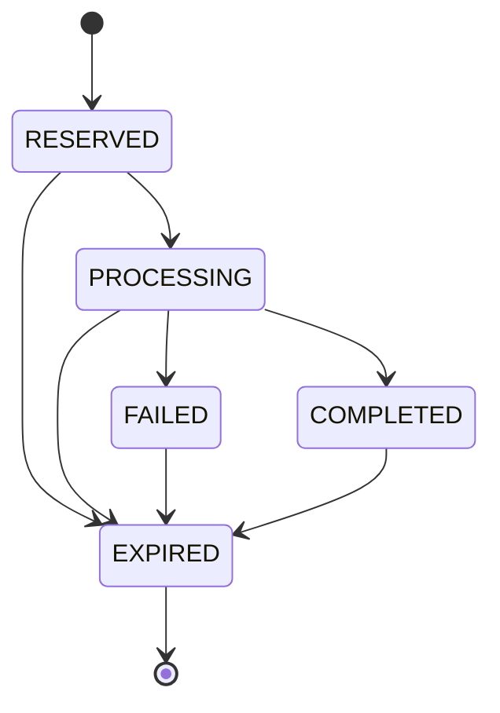
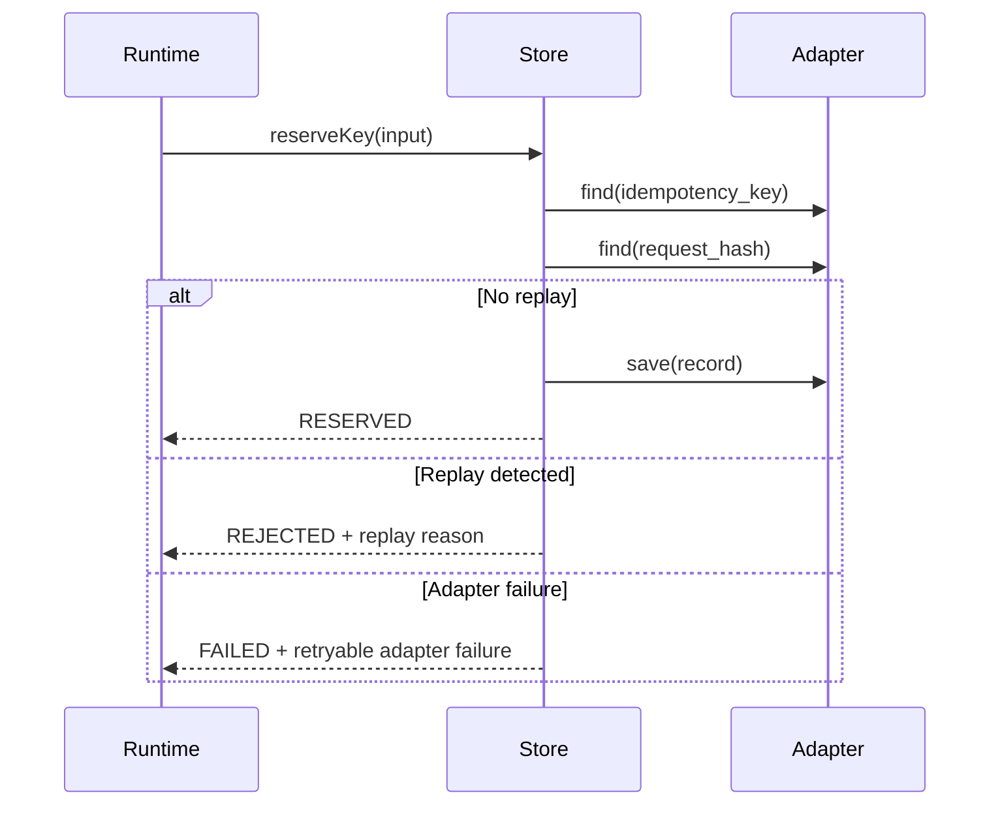

# AG-3C — Durable Idempotency & Replay Store

## 1. Purpose

AG-3C defines the storage-agnostic idempotency and replay-protection layer for the Quantivis Runtime Gateway.

AG-3A introduced in-memory runtime concepts. AG-3B defined the framework-agnostic service boundary. AG-3C introduces persistence-ready contracts for reserving idempotency keys, detecting replay, completing records, expiring reservations, and purging expired records.

This phase does not implement Redis, PostgreSQL, Supabase, HTTP endpoints, queue backends, product workflows, AG-2 logic, or RTS-1 behavior.

## 2. Storage Model

The canonical idempotency record contains:

- `idempotency_key`
- `request_hash`
- `correlation_id`
- `tenant_id`
- `organization_id`
- `created_at`
- `completed_at`
- `expires_at`
- `status`
- `gateway_version`
- `schema_version`
- `runtime_version`

Records are intended to be durable and queryable by both idempotency key and request hash.

## 3. Lifecycle States



States:

- `RESERVED`: key and request hash accepted before downstream processing.
- `PROCESSING`: downstream processing has started.
- `COMPLETED`: processing completed successfully.
- `FAILED`: processing failed but the idempotency record remains reserved.
- `EXPIRED`: record exceeded its TTL or was explicitly expired.

## 4. Reservation Flow



Reservation is deterministic:

1. Check existing idempotency key.
2. Check existing request hash.
3. Reject conflicting or replayed requests.
4. Save a new `RESERVED` record only when no replay condition exists.

## 5. Replay Detection Rules

AG-3C detects:

- duplicate idempotency key;
- duplicate request hash;
- expired reservation reuse;
- conflicting request hash for the same idempotency key;
- cross-tenant or cross-organization key/hash reuse;
- adapter failure.

Replay result fields:

- `replayed`
- `reason`
- `retryable`
- `existing_record`
- `explanation`

Supported reasons:

- `NONE`
- `DUPLICATE_IDEMPOTENCY_KEY`
- `DUPLICATE_REQUEST_HASH`
- `EXPIRED_RESERVATION_REUSE`
- `CONFLICTING_REQUEST_HASH`
- `CROSS_TENANT_KEY_REUSE`
- `ADAPTER_FAILURE`

## 6. Expiration Model

The store supports configurable TTL.

`expires_at` is calculated from:

```text
created_at + ttl_ms
```

Expiration is deterministic and testable because all operations accept explicit timestamps or a configurable `now()` function.

Expired records may be:

- explicitly marked via `expireKey()`;
- detected during replay checks;
- physically removed via `purgeExpired()`.

AG-3C rejects reuse of expired reservations. It does not silently allow a stale idempotency key to become a new request.

## 7. Adapter Contract

The storage adapter is abstract. Required methods:

- `save(record)`
- `find(criteria)`
- `update(idempotency_key, changes)`
- `deleteExpired(now)`
- `exists(criteria)`

AG-3C includes only a deterministic in-memory adapter for tests and local validation. Future durable adapters can implement the same contract.

## 8. Future Persistent Backends

Future implementations may plug in:

- PostgreSQL;
- Supabase;
- Redis;
- Cloudflare D1/KV/Durable Objects;
- managed enterprise key-value stores.

Those backends must preserve the same semantics:

- atomic reservation;
- deterministic replay reason;
- tenant/organization isolation;
- TTL-aware expiration;
- no silent overwrite of an existing key/hash.

## 9. Consistency Guarantees

AG-3C defines the required consistency behavior but does not enforce distributed locks itself.

Durable backends must provide:

- atomic insert/reserve by idempotency key;
- unique lookup by request hash;
- safe handling of concurrent duplicate submissions;
- no lost updates on state transition;
- deterministic replay response for equivalent inputs.

## 10. Operational Assumptions

AG-3C assumes:

- request hashes are generated upstream by AG-3 runtime logic;
- tenant and organization values are already present in the runtime request;
- TTL policy is configured by the runtime service;
- expired records are retained or purged according to operational policy;
- adapter failures must be surfaced as retryable `ADAPTER_FAILURE`, not hidden.

## 11. Verified Status

Implemented files:

- `src/lib/idempotency-store-types.ts`
- `src/lib/idempotency-store.ts`
- `src/test/idempotency-store.test.ts`
- `docs/architecture/AG-3C-Idempotency-Store.md`

Verified behavior:

- reserve new key;
- reject duplicate reservation;
- detect duplicate request hash replay;
- detect conflicting request hash for same key;
- expire records deterministically;
- purge expired records;
- enforce cross-tenant isolation;
- complete records without mutating immutable reservation fields;
- return identical replay outcomes for identical inputs;
- surface adapter failures deterministically.

Deferred intentionally:

- Redis/PostgreSQL/Supabase implementation;
- distributed locking;
- HTTP endpoint integration;
- runtime-service integration;
- deployment wiring;
- AG-2 changes;
- RTS-1 changes.
