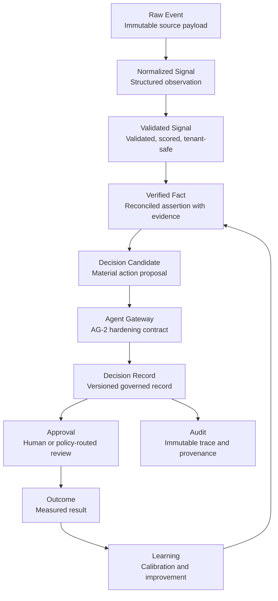

# RTS-1 Real-Time Signal Architecture Specification

## 1. Purpose

Quantivis needs a Real-Time Decision Signal Layer because enterprise decisions are increasingly triggered by changing operational conditions: supplier delays, revenue risk, customer churn, cybersecurity alerts, compliance events, liquidity changes, production interruptions, workforce constraints, and market shifts.

Real-time data in Quantivis must not mean noisy live dashboards where every metric changes every second. That pattern creates executive overload and weakens governance.

For Quantivis, real-time means governed detection of material business changes that may require decisions.

The core thesis is:

> Signals are not decision evidence by default. Signals become decision evidence only after validation, reconciliation, and promotion into verified facts.

The Real-Time Signal Architecture separates raw operational events from decision-grade facts. Executives should not approve actions based on raw events alone. A raw event must pass through normalization, validation, quality scoring, contradiction handling, and fact promotion before it can support a decision candidate and enter the Agent Gateway.

This specification defines the future foundation for SAP, Salesforce, Microsoft Dynamics, ServiceNow, SIEM, IoT, finance, ERP, CRM, and custom enterprise connectors.

## 2. Architecture Principles

- **Evidence before recommendation**: AICIS or any other reasoning system must not recommend consequential action without evidence references and provenance.
- **Raw events are immutable**: A raw source payload is captured as-is, hashed, referenced, and never edited.
- **Signals are normalized observations**: A normalized signal is a structured interpretation of a raw event, not yet decision-grade evidence.
- **Facts require validation and reconciliation**: A verified fact must be derived from validated signals, evidence references, quality scoring, and contradiction handling.
- **Only verified facts can become decision evidence**: Raw events and unvalidated signals may support investigation, but they must not directly justify executive approval.
- **Decision candidates must pass through AG-2**: A decision candidate is not self-authorizing. It must be submitted to the Agent Gateway for schema validation, tenant/org validation, policy routing, replay protection, audit, Decision Record creation, and token signing.
- **Every transition is auditable**: Raw Event to Signal, Signal to Fact, Fact to Decision Candidate, and Candidate to Agent Gateway must be traceable.
- **Tenant isolation is mandatory**: Every object is tenant-scoped and organization-scoped. Cross-tenant promotion or evidence mixing is a critical failure.
- **Provenance is mandatory**: Every signal, fact, and decision candidate must preserve its source system, connector, ingestion run, source record, and payload hash lineage.
- **Idempotency is mandatory**: Duplicate raw events, duplicate signals, and replayed decision candidates must be detected and handled deterministically.
- **Freshness is explicit**: Time-sensitive data must carry freshness status and expiration rules.
- **Materiality gates executive attention**: Only material risks, opportunities, or governance events should become decision candidates.

## 3. Lifecycle Diagram



## 4. Raw Event Schema

A Raw Event is the immutable record of what an enterprise system emitted.

Raw events are not decision evidence by themselves. They are source material for normalization and provenance.

```ts
interface RawEvent {
  raw_event_id: string;
  tenant_id: string;
  organization_id: string;
  source_system: string;
  source_record_id: string | null;
  received_at: string;
  raw_payload_hash: string;
  raw_payload_pointer: string;
  ingestion_run_id: string;
  connector_id: string;
  schema_version: "quantivis.raw-event.v1";
}
```

| Field | Purpose |
| --- | --- |
| `raw_event_id` | Unique immutable raw event identifier. |
| `tenant_id` | Tenant boundary for isolation. |
| `organization_id` | Organization boundary under the tenant. |
| `source_system` | Origin system such as SAP, Salesforce, SIEM, IoT, finance, ERP, CRM, or custom. |
| `source_record_id` | Source-side record identifier when available. |
| `received_at` | Timestamp when Quantivis received the event. |
| `raw_payload_hash` | Hash of the exact raw payload. |
| `raw_payload_pointer` | Storage pointer to the raw payload. This avoids embedding large or sensitive payloads in downstream records. |
| `ingestion_run_id` | Identifier for the ingestion attempt or batch. |
| `connector_id` | Connector instance responsible for ingestion. |
| `schema_version` | Raw Event schema version. |

Immutability rules:

- Raw payloads are never edited.
- Corrections from source systems create new Raw Events.
- Duplicate raw payloads may be deduplicated downstream, but the original ingestion attempt remains auditable.
- Hashes must be computed before normalization.

## 5. Normalized Signal Schema

A Normalized Signal is a structured observation derived from a Raw Event.

It asks:

- Is it trusted?
- Is it fresh?
- Is it material?
- Could this require a decision?

```ts
interface NormalizedSignal {
  signal_id: string;
  raw_event_id: string;
  tenant_id: string;
  organization_id: string;
  source_system: string;
  signal_type: string;
  observed_at: string;
  received_at: string;
  payload_hash: string;
  provenance: {
    connector_id: string;
    ingestion_run_id: string;
    source_record_id: string | null;
    raw_payload_hash: string;
  };
  freshness: {
    age_seconds: number;
    status: "fresh" | "stale" | "expired";
    evaluated_at: string;
    expires_at: string | null;
  };
  materiality: {
    score: number;
    estimated_impact: number | null;
    currency: string | null;
    rationale: string;
  };
  trust: {
    integrity: "verified" | "unverified" | "failed";
    confidence: number;
    reason: string | null;
  };
  quality: {
    completeness: number;
    consistency: number;
    freshness: number;
    provenance: number;
    integrity: number;
    overall: number;
  };
  idempotency_key: string;
  replay_window: {
    starts_at: string;
    expires_at: string;
  };
  decision_trigger: {
    required: boolean;
    reason: string | null;
    candidate_decision_type: string | null;
  };
  schema_version: "quantivis.normalized-signal.v1";
}
```

Normalized Signals are not automatically evidence. They become evidence only if validated and then promoted into Verified Facts.

## 6. Validated Signal

A Validated Signal is a Normalized Signal that passed the validation gate.

Validation includes:

- **Schema validation**: Required fields exist and conform to the canonical schema.
- **Tenant validation**: `tenant_id` is valid and belongs to the source connection.
- **Organization validation**: `organization_id` is valid under the tenant.
- **Source validation**: Connector, source system, and source record metadata are allowed for that tenant.
- **Freshness validation**: The signal is not too old for its signal type and use case.
- **Idempotency/replay validation**: Duplicate or replayed signals are detected before downstream promotion.
- **Provenance validation**: Raw payload hash, connector ID, ingestion run, and source record lineage are present.
- **Quality scoring**: Completeness, consistency, freshness, provenance, integrity, and overall quality are computed.

Validation outcomes:

- `accepted`: Signal may be considered for fact promotion.
- `quarantined`: Signal is preserved but not eligible for fact promotion until reviewed or reconciled.
- `rejected`: Signal is not eligible for fact promotion and must not influence recommendations.

## 7. Quality Scoring

Quality scoring prevents poor enterprise data from silently influencing recommendations.

```ts
interface SignalQuality {
  completeness: number;
  consistency: number;
  freshness: number;
  provenance: number;
  integrity: number;
  overall: number;
}
```

Scores use a 0 to 100 scale.

| Score | Meaning |
| --- | --- |
| `completeness` | Required fields and key business dimensions are present. |
| `consistency` | Values do not conflict with known schemas, expected ranges, or related records. |
| `freshness` | Signal is current enough for the decision context. |
| `provenance` | Source system, connector, raw payload hash, and source record lineage are present and trusted. |
| `integrity` | Payload hash and validation checks indicate no tampering or corruption. |
| `overall` | Weighted quality score used for promotion eligibility. |

Recommended default thresholds:

| Outcome | Default rule |
| --- | --- |
| `accept` | `overall >= 80` and no critical validation failure. |
| `quarantine` | `50 <= overall < 80` or unresolved medium contradiction. |
| `reject` | `overall < 50`, failed integrity, invalid tenant, invalid organization, expired freshness, or critical contradiction. |

Thresholds should become policy-configurable in later implementation phases.

## 8. Contradiction Model

Enterprise systems frequently disagree. Quantivis must preserve contradictions instead of hiding them.

Example:

- SAP reports inventory = 250.
- Warehouse scanner reports inventory = 143.
- ERP reports inventory = 247.

Contradiction schema:

```ts
interface SignalContradiction {
  contradiction_id: string;
  tenant_id: string;
  organization_id: string;
  source_a: {
    source_system: string;
    signal_id: string;
    field: string;
    value: unknown;
  };
  source_b: {
    source_system: string;
    signal_id: string;
    field: string;
    value: unknown;
  };
  severity: "low" | "medium" | "high" | "critical";
  confidence: number;
  resolution_status: "open" | "resolved" | "accepted_exception" | "quarantined";
  evidence_references: string[];
  detected_at: string;
}
```

Contradiction handling rules:

- Critical contradictions block fact promotion.
- High contradictions require explicit resolution or executive-visible challenge context.
- Medium contradictions may quarantine a signal depending on materiality.
- Low contradictions may be recorded without blocking if the verified fact remains defensible.
- Contradictions become part of the evidence surface for executive review.

## 9. Verified Fact Schema

A Verified Fact is a reconciled assertion derived from one or more validated signals.

Verified Facts, not raw signals, become decision evidence.

```ts
interface VerifiedFact {
  fact_id: string;
  tenant_id: string;
  organization_id: string;
  fact_type: string;
  assertion: string;
  source_signals: string[];
  evidence_references: string[];
  confidence: number;
  contradictions: SignalContradiction[];
  provenance_hash: string;
  verified_at: string;
  expires_at: string | null;
  status: "active" | "superseded" | "expired" | "quarantined" | "rejected";
  schema_version: "quantivis.verified-fact.v1";
}
```

| Field | Purpose |
| --- | --- |
| `fact_id` | Unique verified fact identifier. |
| `tenant_id` | Tenant boundary. |
| `organization_id` | Organization boundary. |
| `fact_type` | Category such as supplier delay, inventory mismatch, revenue risk, cyber incident, compliance trigger. |
| `assertion` | Plain-English fact claim. |
| `source_signals` | Validated signals used to derive the fact. |
| `evidence_references` | Evidence IDs that support the assertion. |
| `confidence` | Confidence in the reconciled fact, 0 to 100. |
| `contradictions` | Known contradictions and resolution status. |
| `provenance_hash` | Stable hash of source signal/evidence lineage. |
| `verified_at` | Time of fact verification. |
| `expires_at` | Time when the fact becomes ineligible for new decisions unless refreshed. |
| `status` | Current fact status. |
| `schema_version` | Verified Fact schema version. |

Fact promotion rules:

- Facts must be tenant-safe.
- Facts must have evidence references.
- Facts must have source signals.
- Facts must include confidence.
- Facts with critical open contradictions are not decision-grade.
- Expired facts cannot create new decision candidates.

## 10. Decision Candidate Schema

A Decision Candidate is a proposed action derived from one or more Verified Facts.

```ts
interface DecisionCandidate {
  candidate_id: string;
  fact_ids: string[];
  tenant_id: string;
  organization_id: string;
  candidate_decision_type: string;
  recommended_action: string;
  materiality_score: number;
  estimated_impact: {
    amount: number | null;
    currency: string | null;
    description: string;
  };
  risk_level: "low" | "medium" | "high" | "critical";
  confidence: number;
  evidence_references: string[];
  agent_gateway_payload_preview: {
    agent_id: string;
    tenant_id: string;
    organization_id: string;
    idempotency_key: string;
    decision_type: string;
    requested_action: string;
    evidence_references: string[];
    confidence: number;
    business_impact: {
      amount?: number;
      currency?: string;
      description: string;
    };
    risk_level: "low" | "medium" | "high" | "critical";
    justification: string;
    metadata: Record<string, unknown>;
  };
  schema_version: "quantivis.decision-candidate.v1";
}
```

A Decision Candidate is not an approval. It is a handoff object for AG-2.

## 11. AG-2 Handoff

Decision Candidates become Agent Gateway requests.

Mapping:

| Decision Candidate | AG-2 Agent Gateway field |
| --- | --- |
| `candidate_id` | `metadata.candidate_id` |
| `fact_ids` | `metadata.fact_ids` |
| `tenant_id` | `tenant_id` |
| `organization_id` | `organization_id` |
| `candidate_decision_type` | `decision_type` |
| `recommended_action` | `requested_action` |
| `evidence_references` | `evidence_references` |
| `confidence` | `confidence` |
| `estimated_impact` | `business_impact` |
| `risk_level` | `risk_level` |
| fact assertions + rationale | `justification` |
| deterministic candidate key | `idempotency_key` |
| fact/signal/provenance context | `metadata` |

Example AG-2 payload:

```ts
const agentGatewayRequest = {
  agent_id: "aicis-real-time-signal-engine",
  tenant_id: candidate.tenant_id,
  organization_id: candidate.organization_id,
  idempotency_key: `decision-candidate:${candidate.candidate_id}`,
  decision_type: candidate.candidate_decision_type,
  requested_action: candidate.recommended_action,
  evidence_references: candidate.evidence_references,
  confidence: candidate.confidence,
  business_impact: {
    amount: candidate.estimated_impact.amount ?? undefined,
    currency: candidate.estimated_impact.currency ?? undefined,
    description: candidate.estimated_impact.description,
  },
  risk_level: candidate.risk_level,
  justification: "Verified facts indicate a material business change requiring decision review.",
  metadata: {
    candidate_id: candidate.candidate_id,
    fact_ids: candidate.fact_ids,
    source: "rts-1",
  },
};
```

AG-2 then validates schema, validates tenant and organization, applies replay protection, assembles evidence, evaluates policy, creates a Decision Record, writes audit events, and returns a signed decision token for successful gateway outcomes.

## 12. Audit and Provenance

RTS-1 requires hash chaining and provenance references across every lifecycle transition.

Required lineage:

```text
Raw Event hash
↓
Normalized Signal payload hash
↓
Validated Signal quality/provenance record
↓
Verified Fact provenance hash
↓
Decision Candidate idempotency key
↓
AG-2 request hash
↓
Decision Record hash
↓
Audit event ID
↓
Certification artifact
```

Audit requirements:

- Raw event receipt is auditable.
- Signal normalization is auditable.
- Validation outcome is auditable.
- Quarantine/reject/accept decisions are auditable.
- Fact promotion is auditable.
- Contradiction detection and resolution are auditable.
- Decision candidate generation is auditable.
- AG-2 handoff is auditable.

Certification relevance:

- Certification should prove that signals were not treated as evidence before validation.
- Certification should prove tenant isolation for signal/fact/candidate lineage.
- Certification should include replay/idempotency evidence.
- Certification should include contradiction test evidence.
- Certification should include AG-2 handoff evidence.

## 13. Freshness Rules

Freshness defines whether a signal or fact is current enough to support a decision.

| Status | Meaning | Decision eligibility |
| --- | --- | --- |
| `fresh` | Within expected freshness SLA for the signal/fact type. | Eligible if quality and evidence requirements pass. |
| `stale` | Older than ideal but not expired. | May support low/medium-risk decisions with warning; should not silently support high-risk actions. |
| `expired` | Too old for decision use. | Not eligible for new decision candidates. |

Freshness examples:

- Cybersecurity alert: seconds/minutes.
- IoT production interruption: seconds/minutes.
- Supplier delivery risk: minutes/hours.
- Financial KPI snapshot: hourly/daily.
- Compliance event: event-based with explicit effective dates.

Stale or expired data must be visible in executive review if it influences a decision.

## 14. Idempotency and Replay Protection

RTS-1 must handle duplicate and replayed inputs at multiple layers.

Duplicate raw events:

- Same `raw_payload_hash`, source system, source record, and connector within a replay window.
- Preserve ingestion audit.
- Avoid generating duplicate downstream signals unless the source event is a legitimate correction.

Duplicate normalized signals:

- Same `idempotency_key` or equivalent signal fingerprint.
- Reuse or reference existing signal outcome.
- Do not generate duplicate facts.

Replayed decision candidates:

- Same candidate/fact/evidence lineage submitted again to AG-2.
- AG-2 `idempotency_key` must be deterministic.
- Replayed submissions must be rejected or resolved deterministically by the gateway adapter.

Idempotency keys should include:

- tenant,
- organization,
- source system or engine,
- source record or candidate ID,
- normalized event type,
- time bucket or source version where appropriate.

## 15. Outcome Learning Loop

RTS-1 must connect observations to learning.

```text
Signal
↓
Fact
↓
Decision
↓
Outcome
↓
Prediction evaluation
↓
Confidence calibration
↓
Future recommendation improvement
```

Track:

- **Prediction accuracy**: Did the predicted risk/opportunity occur?
- **Fact validity**: Was the verified fact later confirmed, corrected, superseded, or rejected?
- **Decision outcome**: Did the approved/rejected action produce the expected operational/financial/compliance result?
- **Confidence recalibration**: Should future confidence from similar signal/fact patterns increase or decrease?
- **Source reliability**: Which source systems or connectors repeatedly produce high-quality or low-quality signals?

This loop is central to AICIS becoming a learning intelligence engine rather than a static inference layer.

## 16. Connector Onboarding Rules

Before adding any connector, the connector must declare:

- source system;
- supported event types;
- schema mapping into Raw Event and Normalized Signal;
- freshness SLA per event type;
- provenance fields;
- tenant and organization boundary model;
- replay/idempotency strategy;
- expected duplicate/correction behavior;
- failure modes;
- retry behavior;
- quarantine behavior;
- data sensitivity classification;
- evidence references it can produce;
- test fixtures for schema, freshness, replay, contradiction, and tenant isolation.

No connector should write directly into dashboards or Decision Records. Connectors produce Raw Events and Normalized Signals only.

## 17. Staging Evidence Requirements

Before RTS enters production, staging must prove:

- schema validation tests for Raw Event, Normalized Signal, Verified Fact, and Decision Candidate;
- replay/idempotency tests for raw events, signals, and AG-2 candidate handoff;
- contradiction detection tests;
- tenant isolation tests across raw events, signals, facts, candidates, evidence, and AG-2 payloads;
- AG-2 handoff tests;
- quality scoring tests;
- freshness status tests;
- quarantine/reject/accept tests;
- certification artifact generation;
- audit lineage preservation from raw event to Decision Record;
- failure-mode tests for malformed source payloads, stale data, missing provenance, duplicate events, and cross-tenant contamination.

No production readiness claim should be made until staging artifacts exist and are archived.

## 18. Implementation Roadmap

### RTS-1A: Schema/contracts

- Define TypeScript contracts.
- Add schema validation.
- Add deterministic hash helpers.
- Add unit tests.
- No connector implementation.

### RTS-1B: Quality scoring

- Implement quality scoring primitives.
- Define configurable thresholds.
- Test accept/quarantine/reject behavior.

### RTS-1C: Contradiction detection

- Implement contradiction model.
- Add source-field conflict detection.
- Add severity and resolution status.

### RTS-1D: Fact promotion

- Promote validated signals into Verified Facts.
- Enforce evidence, quality, freshness, and contradiction rules.

### RTS-1E: Decision candidate generation

- Generate Decision Candidates from Verified Facts.
- Preserve evidence references and materiality/risk.

### RTS-1F: AG-2 handoff

- Convert Decision Candidates to AG-2 requests.
- Verify idempotency key, evidence references, confidence, business impact, risk, justification, and metadata.

### RTS-1G: Staging evidence

- Execute staging evidence suite.
- Archive certification artifacts.
- Prove tenant isolation and replay protection.

## 19. Non-goals

RTS-1 does not:

- build live dashboards first;
- implement SAP, Salesforce, Microsoft Dynamics, ServiceNow, SIEM, IoT, finance, ERP, CRM, or custom connectors;
- implement runtime code;
- modify product UI;
- execute autonomous actions;
- replace AG-2;
- treat raw signals as evidence;
- bypass evidence validation;
- bypass tenant isolation;
- bypass approval;
- claim production readiness without staging evidence.

## 20. Verification

This RTS-1 sprint is documentation-only.

Required verification:

- Confirm the specification file exists.
- Confirm no runtime/product code was modified by RTS-1.
- Run Markdown lint if available.
- Ensure Mermaid diagrams are syntactically simple and renderable by standard Mermaid flowchart/sequence support.

Current status:

- Specification file: `docs/architecture/RTS-1-Real-Time-Signal-Architecture.md`.
- Runtime code: not modified by this specification.
- Product UI: not modified by this specification.
- Connector implementation: not started.

